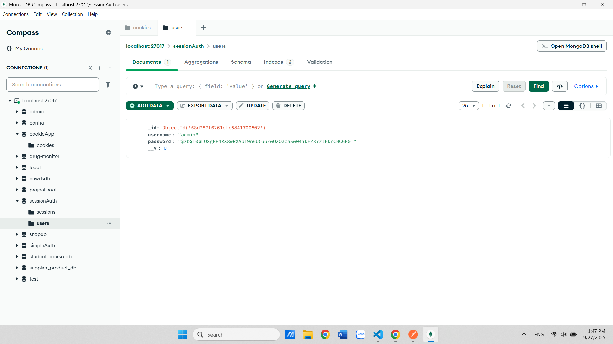
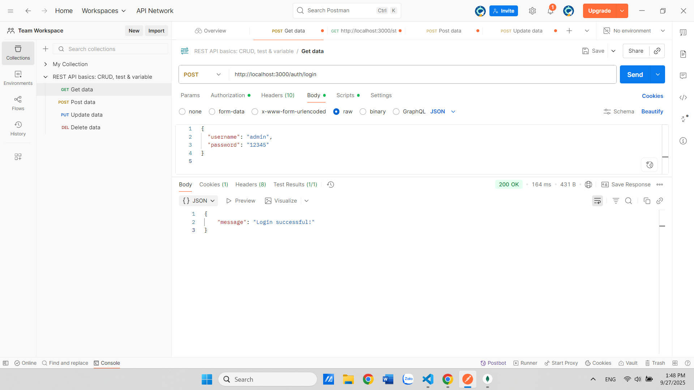
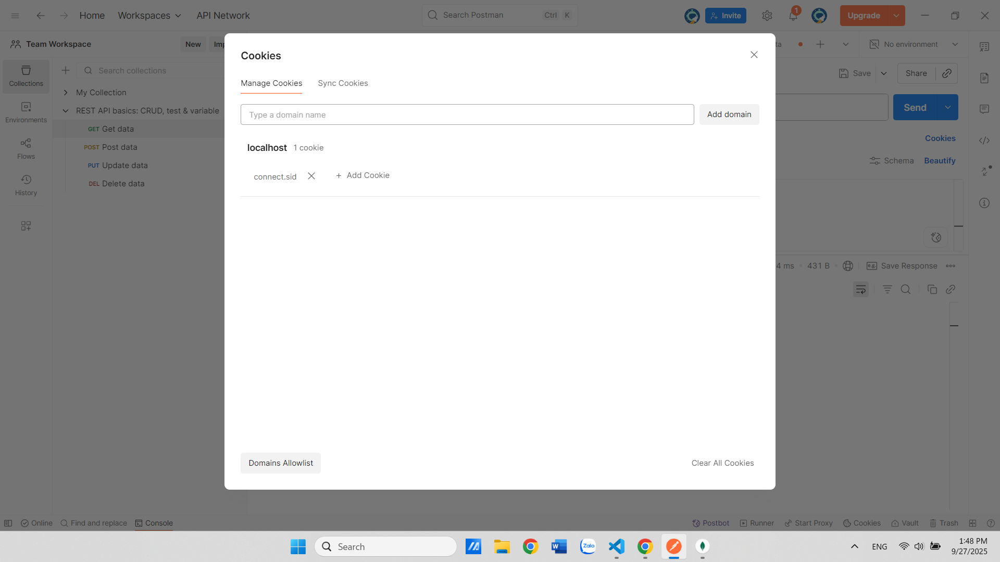
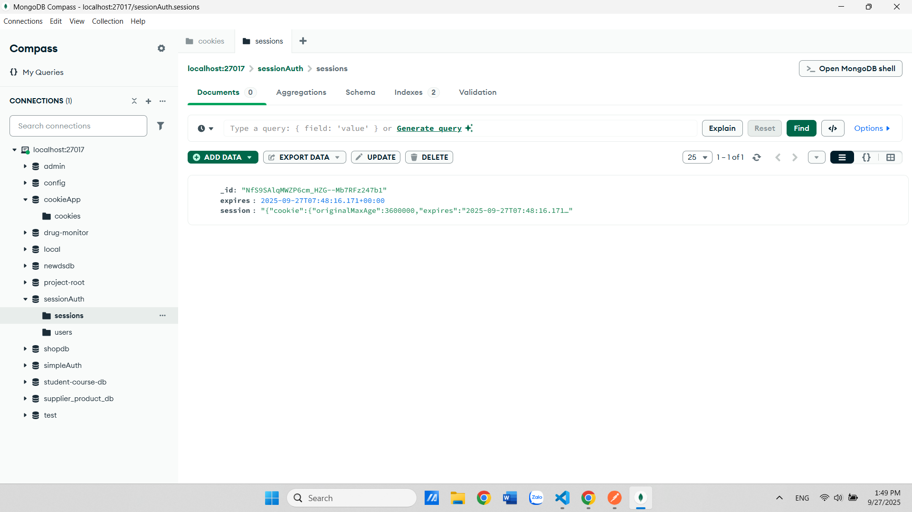
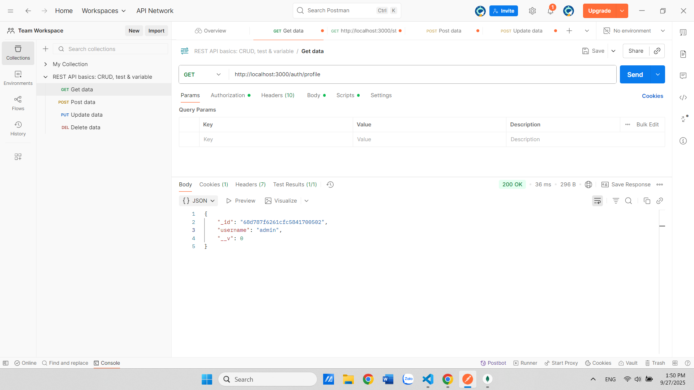
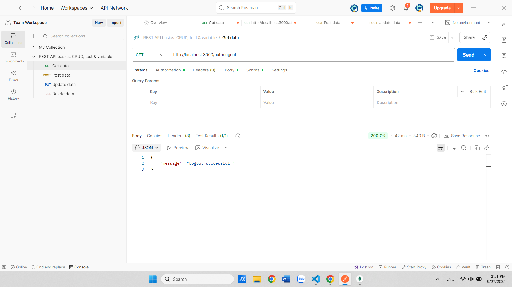
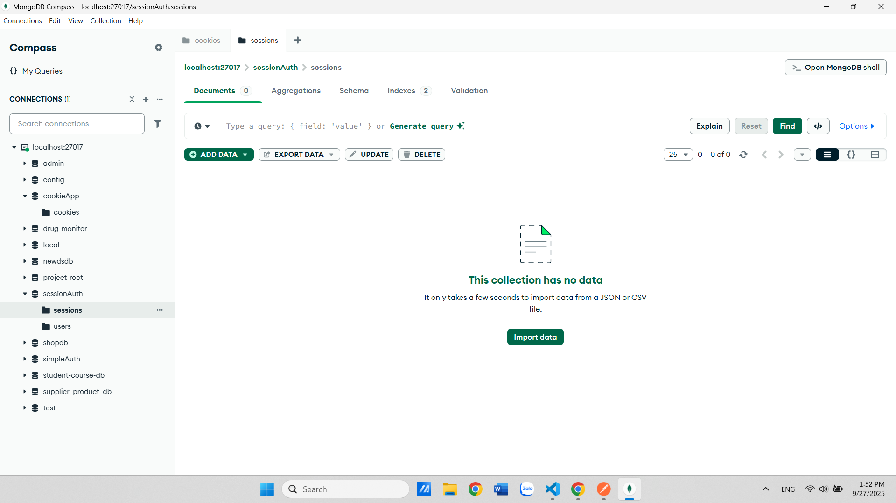

# Cookie Session Auth

## Author
- Student ID: 22685821
- Fullname: Trịnh Văn Vũ

## How to Run
1. Install dependencies:
npm install
2. Run the project:
node `app.js`

## API Testing with Postman
### 1. Register
- Open Postman.
- Send POST request to `/register` with required data.

- Check database to confirm new user is created.

### 2. Login
- Send POST request to `/login` with registered credentials.

- Check cookie

- Check database to confirm session is created.

### 3. Profile
- Endpoint: GET /profile

### 4. Logout
- Send GET request to `/logout`.

- check cookie delete in mongodb

